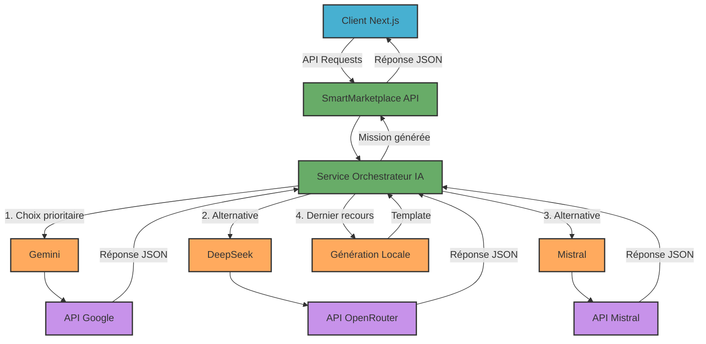

# 🚀 SmartMarketplace API - Backend ASP.NET Core 9

> **API intelligente de génération de missions freelance avec intégration multi-IA (Gemini, DeepSeek, Mistral)**

## 📋 Vue d'ensemble

Cette API ASP.NET Core 9 permet de générer automatiquement des missions freelance détaillées à partir de descriptions simples en utilisant 3 services d'IA différents avec système de fallback intelligent.


## 🏗️ Architecture



## 📊 Models/

### 1. **POST** `/api/Mission/generate`
Génère une mission freelance à partir d'une description simple.

**Request Body:**
```json
{
  "simpleInput": "Backend Node.js Rabat 3500DH remote 6 mois senior",
  "preferredProvider": "DeepSeek" // Optionnel: "Gemini", "DeepSeek", "Mistral"
}
```

**Response:**
```json
{
  "success": true,
  "data": {
    "id": "guid-generated",
    "title": "Développeur Backend Node.js/Express.js - Rabat (REMOTE)",
    "description": "🎯 CONTEXTE DU PROJET :\nDéveloppement d'une API e-commerce...",
    "country": "Morocco",
    "city": "Rabat",
    "workMode": "REMOTE",
    "duration": 6,
    "durationType": "MONTH",
    "startImmediately": true,
    "startDate": null,
    "experienceYear": "7-12",
    "contractType": "FORFAIT",
    "estimatedDailyRate": 350,
    "domain": "Backend Development",
    "position": "Développeur Backend",
    "requiredExpertises": ["Node.js", "Express.js", "MongoDB", "PostgreSQL"],
    "createdAt": "2025-06-14T22:00:00Z"
  },
  "provider": "DeepSeek"
}
```

### 2. **POST** `/api/Mission/save`
Sauvegarde une mission.

**Request Body:**
```json
{
  "title": "Titre de la mission",
  "description": "Description détaillée",
  "city": "Rabat",
  // ... autres propriétés Mission
}
```

### 3. **GET** `/api/Mission`
Récupère toutes les missions sauvegardées.

### 4. **GET** `/api/Mission/{id}`
Récupère une mission par son ID.

### 5. **DELETE** `/api/Mission/{id}`
Supprime une mission.

### 6. **GET** `/api/Mission/ai-status`
Vérifie le statut des services IA.

**Response:**
```json
{
  "success": true,
  "data": {
    "Gemini": true,
    "DeepSeek": true,
    "Mistral": false
  }
}
```

## 🤖 Providers IA Disponibles

| Provider | Modèle | Spécialités | API |
|----------|---------|-------------|-----|
|  **Google Gemini** *(Défaut)* | `gemini-1.5-flash` | • Génération rapide<br>• Texte structuré<br>• Support français | Google Generative Language |
|  **DeepSeek R1** | `deepseek/deepseek-r1:free` | • Chain-of-Thought<br>• Analyse logique<br>• Missions techniques | OpenRouter (proxy) |
|  **Mistral AI** | `mistral-small-2503` | • Contexte français<br>• Missions locales<br>• Conformité RGPD | Mistral AI API |
### Extraction Intelligente

L'API analyse automatiquement l'input utilisateur pour extraire :

- **Ville** : Rabat, Casablanca, Marrakech, etc.
- **Mode de travail** : Remote, Onsite, Hybrid
- **Durée** : 3 mois, 6 semaines, 1 an
- **Budget** : 3500DH → 350€ (conversion automatique)
- **Niveau** : Junior, Senior, Expert
- **Technologies** : Node.js, React, Python, etc.
- **Domaine** : Backend, Frontend, Full Stack, etc.

### Prompts Intelligents

```csharp
// Exemple de prompt généré automatiquement
var prompt = $@"Tu es un expert en création de missions freelance.
À partir de cette description : ""Backend Node.js Rabat 3500DH remote 6 mois senior""

Génère une mission au format JSON EXACT :
{{
  ""title"": ""Développeur Backend Node.js - Rabat"",
  ""city"": ""Rabat"",
  ""estimatedDailyRate"": 350,
  ""workMode"": ""REMOTE"",
  ""duration"": 6,
  ""experienceYear"": ""7-12"",
  ""requiredExpertises"": [""Node.js"", ""Express.js"", ""MongoDB""]
}}";
```

## ⚙️ Configuration APIs

```json
{
  "AI": {
    "DefaultProvider": "Gemini",
    "Gemini": {
      "ApiKey": "AIzaSy-YOUR_GEMINI_KEY_HERE",
      "BaseUrl": "https://generativelanguage.googleapis.com/v1beta",
      "Model": "gemini-1.5-flash"
    },
    "DeepSeek": {
      "ApiKey": "sk-or-v1-YOUR_DEEPSEEK_KEY_HERE",
      "BaseUrl": "https://api.openrouter.ai/v1",
      "Model": "deepseek/deepseek-r1:free"
    },
    "Mistral": {
      "ApiKey": "YOUR_MISTRAL_KEY_HERE",
      "BaseUrl": "https://api.mistral.ai/v1",
      "Model": "mistral-small-2503"
    }
  }
}
```

## 🚀 Installation et Démarrage

### Prérequis
- **.NET 9.0 SDK**
- **Clés API** pour au moins un service IA

### Installation

```bash
# 1. Cloner et naviguer
cd SmartMarketplace

# 2. Restaurer les dépendances
dotnet restore

# 3. Configurer les clés API dans appsettings.json

# 4. Compiler
dotnet build

# 5. Lancer l'API
dotnet run
```

### Accès

- **API** : `https://localhost:5001`
- **Swagger UI** : `https://localhost:5001/swagger` (en développement)
- **Health Check** : `https://localhost:5001/health`


## 🔄 Workflow Complet

1. **Client** envoie description simple
2. **AIService** analyse et extrait informations
3. **Prompt intelligent** généré automatiquement
4. **Tentative avec provider préféré**
5. **Fallback** vers autres providers si échec
6. **Génération locale** en dernier recours
7. **Validation** et enrichissement des données
8. **Retour** de la mission complète


## 👥 Team

| Avatar                                                                                                  | Name | Role | GitHub |
|---------------------------------------------------------------------------------------------------------|------|------|--------|
|         | Zakariae Azarkan | WebCam Object Detection | [@zachary013](https://github.com/zachary013) |
|           | Salaheddine El Jably | Model Training | [@Sam-Jab](https://github.com/Sam-Jab) |
